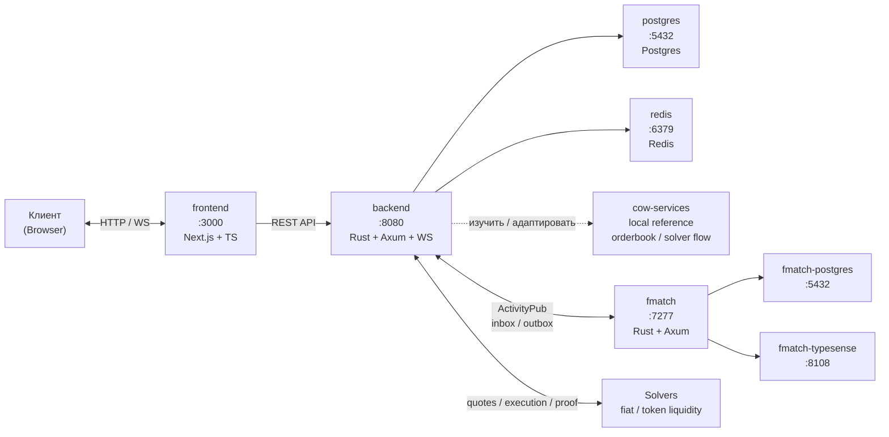
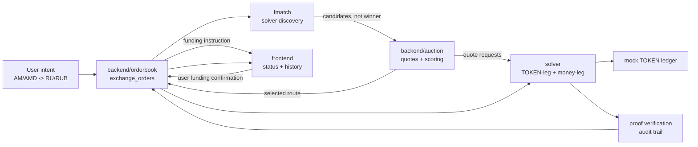
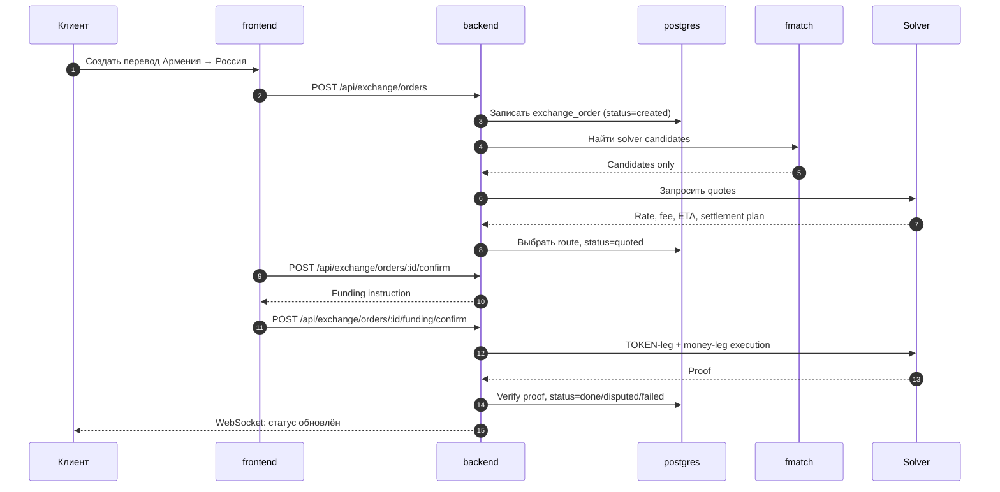

# Pay3Flow

Трансграничные обменные платежи с комиссией ниже, чем SWIFT.

## Идея

Получаем платёжный intent пользователя → подбираем solver'ов и ликвидность →
проводим две локальные денежные ноги через участников сети →
фиксируем статус, комиссии, подтверждения и спорные ситуации.

Целевой поток:

```text
Армения → Pay3Flow → TOKEN exchange → money exchange → Россия
```

Старый контур через эквайеров остаётся как fallback/исторический слой, но
новая целевая архитектура строится вокруг orderbook + solver competition
по модели CoW Protocol.

## Роли Cow и fmatch

`fmatch` остаётся нашим рабочим matcher'ом solver'ов: через ActivityPub он
находит подходящих исполнителей, принимает/отдаёт offers и возвращает
кандидатов.

`cowprotocol-services/` нужен как reference-архитектура, а не замена `fmatch`.
Из CoW берём идеи orderbook, auction window, solver competition, выбор
победителя, settlement/status/proof flow. В Pay3Flow эти идеи адаптируются
так: backend хранит orders, `fmatch` ищет solver'ов, backend собирает quotes
и выбирает маршрут.

## Микросервисы

| Сервис | Каталог | Стек | Описание |
|--------|---------|------|----------|
| `frontend` | `frontend/` | Next.js + TypeScript | Веб-интерфейс |
| `backend` | `backend/` | Rust (Axum, WebSocket, Postgres, Redis) | Ядро: auth, intents, маршрутизация, статусы, споры |
| `cow-services` | `cowprotocol-services/` | Rust | Референс CoW Protocol Services: orderbook, auction/solver flow, settlement patterns |
| `fmatch` | `fmatch/` | Rust (Axum, sqlx) | Федеративный discovery/matching solver'ов и участников сети |

> `cowprotocol-services/` должен быть локальной копией
> `https://github.com/cowprotocol/services` для изучения и адаптации, а не
> прямой production-зависимостью без аудита.

## Архитектура: топология сервисов



## Архитектура: exchange-flow



Эквайеры, старый `transactions/routes` контур и acquiring provider adapters
остаются legacy/fallback rail. Новый MVP строится вокруг `exchange_orders`,
solver candidates, quotes, selected route, funding instruction, mock TOKEN
ledger, money-leg и proof.

## Поток данных: exchange order



## Поток данных: кратко

```text
Клиент
  │
  ▼
┌──────────┐  POST /api/exchange/orders  ┌──────────┐
│ frontend │ ───────────────────────────▶│ backend  │
└──────────┘                      └────┬─────┘
                                       │ 1. Записать exchange_order
                                       │ 2. Найти solver candidates
                                       ▼
                                 ┌──────────┐
                                 │  fmatch  │ ← ActivityPub inbox/outbox
                                 └────┬─────┘
                                      │ 3. Вернуть candidates, не winner
                                      │ 4. Backend auction / quotes / winner
                                      ▼
                                 ┌──────────┐
                                 │ backend  │
                                 └────┬─────┘
                                      │ 5. Funding instruction + user consent
                                      │ 6. Mock TOKEN-leg + money-leg + proof
                                      ▼
                                 ┌──────────┐
                                 │ Solver   │ (ликвидность)
                                 └──────────┘
```

## Быстрый старт

```bash
docker compose up -d --build
curl -sS http://localhost:8080/health
```

## Структура

```text
pay3flow/
├── frontend/      # Next.js + TS
├── backend/       # Rust: Axum + WS + ActivityPub + Postgres + Redis
├── cowprotocol-services/ # локальный reference CoW Protocol Services
├── fmatch/        # матчер (отдельный репозиторий)
├── docs/          # документация (API, схемы, глоссарий)
├── scripts/       # утилиты (health-check и т.д.)
├── docker-compose.yml
└── .github/       # CI
```

## Порты

| Сервис | Порт | Назначение |
|--------|------|------------|
| `frontend` | `3000` | Веб-интерфейс |
| `backend` | `8080` | REST API + WebSocket |
| `postgres` | `5435` | PostgreSQL (наш backend) |
| `redis` | `6379` | Кэш quotes/candidates |
| `fmatch` | `7277` | ActivityPub-матчер |
| `fmatch-postgres` | `5433` | PostgreSQL (fmatch) |
| `fmatch-typesense` | `8108` | Поиск (Typesense) |

## Лицензия

Пока не определена.
