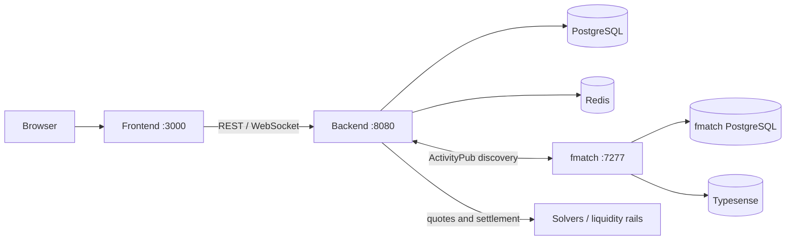

# Pay3Flow

Pay3Flow is an experimental cross-border exchange platform. It turns a user
intent into an exchange order, discovers eligible solvers, compares quotes,
collects explicit funding consent, and records settlement proofs.

The current implementation is an MVP with a mock TOKEN ledger and fake/local
solvers. It is not production-ready payment infrastructure and must not be
used to process real funds without a separate legal, compliance, security, and
operational review.

## Product model

The primary flow is a solver-based exchange rather than a provider picker:

```text
user intent -> exchange order -> solver discovery -> quote auction
             -> selected route -> funding instruction -> settlement -> proof
```

The first target corridor is `AM/AMD -> RU/RUB`, but country and currency are
data fields and the domain model is designed for additional corridors.

The settlement model has two conceptual legs:

1. `TOKEN-leg`: a reserve, transfer, or internal accounting step. The MVP uses
   a mock ledger.
2. `money-leg`: local delivery to the recipient through the selected rail.

The user must see and accept the route, amount, fees, timing, and any TOKEN or
crypto settlement asset involved. Pay3Flow must never present a multi-leg
route as an undisclosed direct fiat transfer.

## Service topology

| Service | Directory | Stack | Responsibility |
| --- | --- | --- | --- |
| Web frontend | `pay3low-svelte-frontend/` | SvelteKit + TypeScript | Exchange form, quotes, route details, status and history |
| Backend | `backend/` | Rust, Axum, PostgreSQL, Redis | Auth, orders, discovery, auction, settlement state and API |
| fmatch | `fmatch/` | Rust, Axum, ActivityPub | Federated solver discovery and candidate matching |
| CoW reference | `cowprotocol-services/` | Rust | Local reference for orderbook and solver-auction patterns; not a production dependency |



`fmatch` returns candidates; it does not select the final Pay3Flow winner and
does not own settlement. The backend remains the orderbook, quote collector,
scoring engine, and settlement state machine. Acquiring adapters and the old
`transactions/routes` flow remain available as legacy or fallback rails.

## Quick start

Requirements: Docker Compose, `curl`, and `jq` for the smoke test.

```bash
docker compose up -d --build
curl -fsS http://localhost:8080/health
curl -fsS http://localhost:7277/health
```

Open the frontend at <http://localhost:3000>.

Run the exchange smoke test after the services are healthy:

```bash
./scripts/exchange-flow.sh
```

The smoke test covers corridor validation, idempotent order creation, fmatch
discovery or fallback, quote selection, the consent gate, proof handling,
disputes, kill switches, audit history, and order history.

For a local frontend-only workflow, see
[`pay3low-svelte-frontend/README.md`](pay3low-svelte-frontend/README.md). For
development and testing conventions, see [`docs/development.md`](docs/development.md).

## Useful API endpoints

The API is still evolving. The most useful MVP endpoints are:

| Method | Endpoint | Purpose |
| --- | --- | --- |
| `GET` | `/health` | Backend health check |
| `POST` | `/api/auth/register` | Register a demo user |
| `POST` | `/api/auth/login` | Log in with the demo code flow |
| `GET` | `/api/exchange/corridors` | List enabled exchange corridors |
| `POST` | `/api/exchange/orders` | Create an exchange order |
| `GET` | `/api/exchange/orders/:id` | Read an order and its current state |
| `POST` | `/api/exchange/orders/:id/discover` | Discover solver candidates |
| `POST` | `/api/exchange/orders/:id/auction` | Collect quotes and select a route |
| `POST` | `/api/exchange/orders/:id/confirm` | Lock a selected quote and show funding instructions |
| `POST` | `/api/exchange/orders/:id/funding/confirm` | Record explicit user consent and start the MVP settlement flow |
| `POST` | `/api/exchange/orders/:id/proof` | Submit a settlement proof |
| `GET` | `/api/exchange/orders/:id/live` | Stream order route updates over WebSocket |
| `GET` | `/api/p2p/routes` | Read-only multi-leg P2P route search |

See [`docs/api-overview.md`](docs/api-overview.md) for request examples and
the complete route families.

## P2P route search

The P2P search is read-only. It looks for routes such as
`AMD -> intermediary asset -> RUB`, checks limits and completion data, and
streams or ranks complete routes. It does not create orders on external
platforms, authenticate to them, or collect full card details.

```bash
curl -G 'http://localhost:8080/api/p2p/routes' \
  --data-urlencode 'source_fiat=AMD' \
  --data-urlencode 'target_fiat=RUB' \
  --data-urlencode 'source_amount=100000' \
  --data-urlencode 'intermediary_assets=USDT,USDC,BTC,ETH,BNB,SOL,TRX,TON' \
  --data-urlencode 'min_orders=20' \
  --data-urlencode 'min_completion_rate=0.9'
```

Details are in [`docs/p2p-search.md`](docs/p2p-search.md) and the source policy
is documented in [`docs/public-p2p-sources.md`](docs/public-p2p-sources.md).

## Repository layout

```text
pay3flow/
├── backend/                    # Rust API, domain logic and migrations
├── fmatch/                     # ActivityPub solver matcher
├── cowprotocol-services/       # Local upstream reference checkout
├── pay3low-svelte-frontend/    # SvelteKit web application
├── docs/                       # Architecture, API, operations and domain docs
├── scripts/                    # Smoke, health and secret-audit scripts
├── docker-compose.yml
└── LICENSE                     # GNU AGPL v3 or later
```

## Development ports

| Service | Host port | Purpose |
| --- | ---: | --- |
| Frontend | `3000` | SvelteKit application |
| Backend | `8080` | REST API, ActivityPub and WebSocket endpoints |
| Backend PostgreSQL | `5435` | Pay3Flow database |
| Redis | `6379` | Cache and short-lived quote data |
| fmatch | `7277` | ActivityPub matcher |
| fmatch PostgreSQL | `5433` | fmatch database |
| Typesense | `8108` | fmatch search index |

## Documentation map

- [`docs/README.md`](docs/README.md) — documentation index and reading paths.
- [`docs/architecture.md`](docs/architecture.md) — service boundaries and data flow.
- [`docs/development.md`](docs/development.md) — local development and verification.
- [`docs/configuration.md`](docs/configuration.md) — environment variables and secrets.
- [`docs/deployment.md`](docs/deployment.md) — deployment checklist and production blockers.
- [`docs/api-overview.md`](docs/api-overview.md) — API route families and examples.
- [`docs/exchange-domain.md`](docs/exchange-domain.md) — tables, invariants and states.
- [`docs/exchange-risk-compliance.md`](docs/exchange-risk-compliance.md) — safety gates.
- [`docs/backend-to-fmatch.org`](docs/backend-to-fmatch.org) — ActivityPub request contract.
- [`docs/fmatch-api.md`](docs/fmatch-api.md) — fmatch surfaces and activity types.
- [`docs/fmatch-offer-schema.md`](docs/fmatch-offer-schema.md) — solver offer format.
- [`docs/p2p-search.md`](docs/p2p-search.md) — read-only P2P route search.
- [`docs/route-aggregation-research.md`](docs/route-aggregation-research.md) — future quote sources.
- [`docs/roadmap-cow.md`](docs/roadmap-cow.md) — CoW-style migration roadmap.
- [`docs/glossary.md`](docs/glossary.md) — domain vocabulary.

## License

Pay3Flow is licensed under the GNU Affero General Public License, version 3 or
any later version (`AGPL-3.0-or-later`). See [`LICENSE`](LICENSE).

The AGPL requires recipients who convey covered modified or derivative works,
including network-accessible modified versions, to receive the corresponding
source under the same license terms. It does not automatically relicense every
independent program that merely communicates with Pay3Flow; consult the license
text and qualified legal counsel for a specific distribution or integration.
