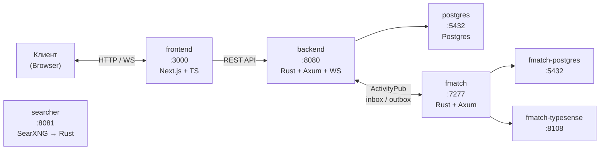
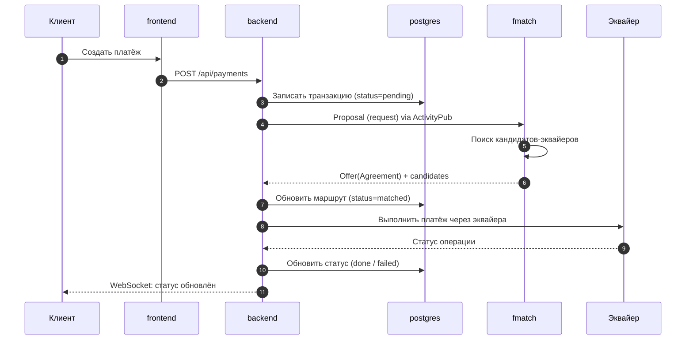

# Pay3Flow

Трансграничные платежи через эквайринг с комиссией ниже, чем SWIFT.

## Идея

Получаем платёжный запрос → ищем подходящего эквайера через `fmatch` →
переводим средства через заранее сохранённые данные эквайера.

## Микросервисы

| Сервис | Каталог | Стек | Описание |
|--------|---------|------|----------|
| `frontend` | `frontend/` | Next.js + TypeScript | Веб-интерфейс |
| `backend` | `backend/` | Rust (Axum, WebSocket, Postgres) | Ядро: auth, платежи, маршрутизация, ActivityPub |
| `fmatch` | `fmatch/` | Rust (Axum, sqlx) | Матчинг запросов к эквайерам (ActivityPub/FEP-0837) |
| `searcher` | `searcher/` | SearXNG → Rust | Поиск новых эквайеров в интернете |

> `fmatch` и `searxng` живут в собственных репозиториях. Исходники SearXNG —
> локальный апстрим для последующей обрезки под `searcher`.

## Архитектура: топология сервисов



## Поток данных: обработка платежа



## Поток данных: кратко

```text
Клиент
  │
  ▼
┌──────────┐  POST /api/payments  ┌──────────┐
│ frontend │ ────────────────────▶│ backend  │
└──────────┘                      └────┬─────┘
                                       │ 1. Записать транзакцию (pending)
                                       │ 2. Отправить Proposal в fmatch
                                       ▼
                                 ┌──────────┐
                                 │  fmatch  │ ← ActivityPub inbox/outbox
                                 └────┬─────┘
                                      │ 3. Найти кандидатов-эквайеров
                                      │ 4. Отправить Offer(Agreement) + candidates
                                      ▼
                                 ┌──────────┐
                                 │ backend  │
                                 └────┬─────┘
                                      │ 5. Исполнить платёж через эквайера
                                      │ 6. Обновить статус
                                      ▼
                                 ┌──────────┐
                                 │ Эквайер  │ (реальный провайдер)
                                 └──────────┘
```

## Быстрый старт

```bash
docker compose up -d --build
curl -sS http://localhost:8080/health
```

## Структура

```text
pay3flow/
├── frontend/      # Next.js + TS
├── backend/       # Rust: Axum + WS + ActivityPub + Postgres
├── fmatch/        # матчер (отдельный репозиторий)
├── searcher/      # поиск эквайеров (SearXNG → Rust)
├── searxng/       # локальная копия апстрима (для обрезки)
├── docs/          # документация (API, схемы, глоссарий)
├── scripts/       # утилиты (health-check и т.д.)
├── docker-compose.yml
└── .github/       # CI
```

## Порты

| Сервис | Порт | Назначение |
|--------|------|------------|
| `frontend` | `3000` | Веб-интерфейс |
| `backend` | `8080` | REST API + WebSocket |
| `postgres` | `5435` | PostgreSQL (наш backend) |
| `fmatch` | `7277` | ActivityPub-матчер |
| `fmatch-postgres` | `5433` | PostgreSQL (fmatch) |
| `fmatch-typesense` | `8108` | Поиск (Typesense) |
| `searcher` | `8081` | Поиск эквайеров (SearXNG) |

## Лицензия

Пока не определена.