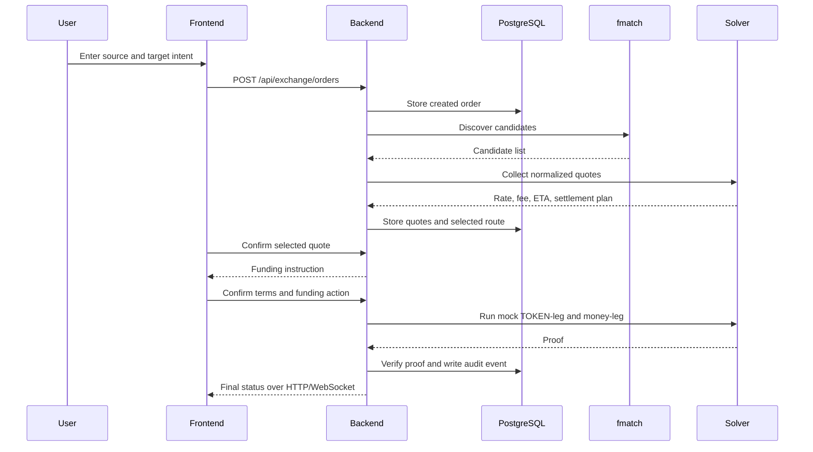

# Architecture

Pay3Flow is a cross-border exchange coordinator. The backend owns the order
lifecycle; external services provide candidate discovery, quotes, and local
execution capability.

## Boundaries

```text
browser
  -> frontend
  -> backend API and WebSocket
       -> PostgreSQL: durable orders, quotes, settlement, audit
       -> Redis: short-lived cache data
       -> fmatch: ActivityPub candidate discovery
       -> solvers: quote and execution integrations
```

### Frontend

The SvelteKit frontend collects the source and target intent, displays quotes
and route details, asks for explicit consent, and renders live status updates.
It does not select a solver independently and it does not hold payment
credentials or custody funds.

### Backend

The Rust/Axum backend provides authentication, corridor validation, exchange
orders, quote normalization, auction selection, funding instructions,
settlement state transitions, proof verification, disputes, and audit events.
It is the source of truth for the Pay3Flow order state.

### fmatch

fmatch is an ActivityPub matcher. It finds candidates whose advertised
capabilities may satisfy a request. It does not own the Pay3Flow order, choose
the final winner, or execute the settlement.

### Solvers and rails

A solver may provide a quote and execute one or both local legs. The MVP uses
fake/local solver profiles and a mock TOKEN ledger. External provider and P2P
adapters must remain read-only or explicitly gated until their authentication,
limits, proof model, and compliance status are reviewed.

## Exchange order flow



Discovery failure may use the local rules-based matcher or cached candidates,
depending on the endpoint and available data. A successful fmatch response is
not silently replaced by local candidates merely because the response is
empty: an empty authoritative result remains empty.

## Legacy boundary

The `transactions`, `routes`, `acquirers`, `/api/payments`, and acquiring
provider adapters are legacy/fallback functionality. They are retained for
compatibility and demos. New exchange features should use
`exchange_orders`, solver candidates, quotes, selected routes, funding
instructions, settlement records, and proofs.

## CoW Protocol reference

The local `cowprotocol-services/` checkout is a reference for orderbook,
auction windows, solver competition, winner selection, settlement lifecycle,
and observability. Its Ethereum-specific assumptions and contracts are not the
Pay3Flow domain model and must not be copied into the fiat exchange core
without an explicit design decision.
