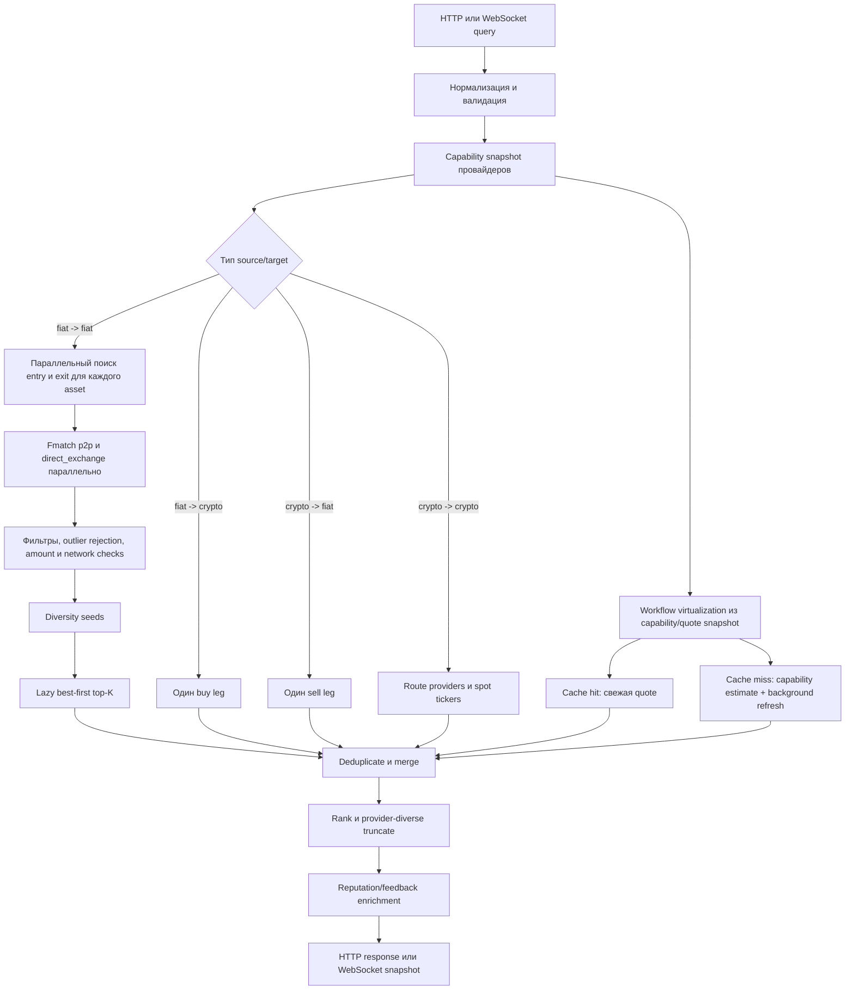

# Пайплайн виртуализации маршрутов

Этот документ описывает текущую реализацию виртуализации маршрутов Pay3Flow.
Orchestration и алгоритмы находятся в
[`backend/src/p2p/virtual/`](../backend/src/p2p/virtual/), публичный контракт
поиска — в [`backend/src/p2p/routes/`](../backend/src/p2p/routes/), получение
предложений и интеграция с Fmatch — в
[`backend/src/p2p/service.rs`](../backend/src/p2p/service.rs), HTTP/WebSocket
обвязка — в
[`backend/src/server/routing/p2p.rs`](../backend/src/server/routing/p2p.rs).

Статус: реализовано в текущей ветке. Актуализировано 2026-10-03.

## Назначение и границы

Виртуализация отвечает на вопрос: «какие исполнимые цепочки можно построить из
доступных сейчас узлов обмена?» Она не исполняет перевод и не обещает
окончательную цену.

Для fiat → fiat базовая цепочка выглядит так:

```text
source fiat -> купить intermediary asset -> при необходимости сменить сеть
            -> продать intermediary asset -> target fiat
```

Есть два класса маршрутов:

- локально составленные entry/exit-маршруты из P2P и direct-exchange офферов;
- workflow-маршруты через route provider, например BestChange или Symbiosis,
  между entry и exit.

Fmatch здесь является универсальным discovery-сервисом: он отдаёт кандидатов,
но не является биржей, route provider или исполнителем. В пользовательском
маршруте всегда указываются реальные venue и provider.

Основной SLO — завершать здоровый production-пайплайн не более чем за одну
секунду, в том числе при множестве одновременных запросов. Это цель
архитектуры, а не секундный timeout с молчаливым отбрасыванием работы.

## Streaming-first этап

Описанные ниже изменения реализованы в текущем коде. HTTP по-прежнему получает
финальный совместимый ответ, а WebSocket публикует промежуточные snapshots.

### 1. Отправлять результат каждой рутины сразу после её завершения

Пайплайн работает streaming-first. Быстрая рутина не ждёт медленные рутины,
общий `join` или полную сборку всех маршрутов. Как только отдельная
рутина получила и проверила полезный результат, она передаёт batch маршрутов в
общий bounded-канал. Агрегатор сразу выполняет инкрементальные deduplicate,
merge и rank, после чего публикует новый WebSocket snapshot или delta.

Поток событий:

```text
routine finished
  -> validated RouteBatch
  -> bounded result channel
  -> incremental deduplicate/merge/rank
  -> immediate WebSocket snapshot/delta
```

При этом:

- первая готовая рутина публикует результат независимо от состояния остальных;
- медленный или зависший источник не задерживает уже найденные маршруты;
- одинаковые маршруты не должны повторно появляться в интерфейсе;
- рейтинг и порядок могут уточняться по мере прихода новых результатов;
- `search_finished` отправляется только после завершения всех производителей;
- отключение клиента отменяет относящиеся к поиску задачи;
- bounded-канал и backpressure не позволяют быстрым производителям бесконтрольно
  накапливать данные в памяти;
- HTTP endpoint остаётся совместимым и возвращает финальный результат, а
  интерактивный frontend использует streaming transport для раннего показа.

Регрессионная проверка: frontend получает и отображает первый валидный batch сразу
после завершения первой рутины, не ожидая завершения всего route search.

### 2. Исправить среднее время ответа на frontend

Показатель среднего времени ответа имеет однозначную семантику и не
зависит от числа повторно полученных WebSocket snapshots. Для активного поиска
каждый уникальный завершённый замер учитывается ровно один раз, накопление
сбрасывается при начале нового поиска, а cache hit не смешивается с реальным
сетевым запросом без явной маркировки.

Модель отображения:

- `last_response_ms` — время последнего завершённого запроса к источнику;
- `average_response_ms` — среднее уникальных завершённых замеров источника в
  текущем поиске;
- cache hit показывается отдельно и не превращает среднее время сети в `0 ms`;
- повторный snapshot одного и того же результата не добавляет новый sample;
- незавершённые и отменённые рутины не учитываются как успешные ответы.

Unit-тест с фиксированным набором событий подтверждает
правильное среднее, reset между поисками и отсутствие двойного учёта snapshots.

### 3. Выделить виртуализацию в `p2p/virtual/`

Алгоритм виртуализации вынесен из API-модуля в отдельное дерево модулей.
Текущая структура:

```text
backend/src/p2p/virtual/
├── mod.rs
├── model/
│   ├── mod.rs
│   └── provider.rs
├── pipeline/
│   ├── mod.rs
│   ├── fiat.rs
│   ├── crypto.rs
│   ├── provider.rs
│   └── provider/
│       ├── discovery.rs
│       ├── fiat.rs
│       └── fiat_crypto.rs
├── composition/
│   ├── mod.rs
│   ├── top_k.rs
│   └── diversity.rs
├── snapshot/
│   ├── mod.rs
│   ├── capabilities.rs
│   └── quotes.rs
└── streaming/
    ├── mod.rs
    └── events.rs
```

Ответственность каталогов:

- `pipeline/` управляет стадиями, параллельностью, отменой и завершением поиска;
- `model/` содержит внутренние типы кандидатов, batch и событий стадий;
- `composition/` строит маршруты, lazy top-K и provider-diverse выборку;
- `snapshot/` работает с capability/quote snapshots;
- `streaming/` передаёт частичные результаты агрегатору и клиенту.

Это разделение не должно привязывать Fmatch к Pay3Flow: Fmatch остаётся
универсальным discovery-сервисом, а доменная виртуализация маршрутов находится
в Pay3Flow.

Orchestration находится в `virtual/pipeline/`, алгоритмы не
зависят от HTTP/WebSocket handlers, а публичное поведение и результаты поиска
не меняются только из-за переноса файлов.

### 4. Разбить `p2p/routes.rs` на модуль `p2p/routes/`

Разросшийся `backend/src/p2p/routes.rs` заменён каталогом с небольшими
модулями с одной ответственностью:

```text
backend/src/p2p/routes/
├── mod.rs
├── query.rs
├── model.rs
├── response.rs
└── tests.rs
```

- `mod.rs` — компактный публичный façade и re-export существующего API;
- `query.rs` — нормализация, валидация и классификация запроса;
- `model.rs` — публичные типы route search;
- `response.rs` — сборка публичного ответа, ranking, fingerprint,
  deduplicate и merge;
- `tests.rs` — регрессии публичного route-search поведения.

`routes/` отвечает за контракт поиска и сборку ответа, а `virtual/` — за сам
алгоритм построения маршрутов. При миграции нельзя одновременно оставлять
`routes.rs` и `routes/mod.rs`; старый файл заменяется каталогом с сохранением
публичных путей типов и функций.

Перенос выполнен без изменения API, циклических
зависимостей и ухудшения функциональных тестов или latency benchmark.

### 5. Оптимизировать pipeline для всех crypto-направлений

Направления fiat → crypto, crypto → fiat и crypto → crypto используют те же
принципы, что и основной fiat → fiat pipeline: конкурентное исполнение,
раннюю публикацию, bounded candidate set и повторное использование snapshots.

Гарантии pipeline:

- локальный leg и независимый provider search не ждут друг друга;
- fiat → crypto публикует отдельно готовый buy leg и каждый готовый
  provider workflow;
- crypto → fiat не получает последовательно exit leg для каждого
  intermediary asset;
- crypto → crypto конкурентно запускает direct/cross-network providers
  и spot ticker paths, не задерживая один класс маршрутов другим;
- provider quote-задачи отдают готовые batches по мере завершения, а не
  сначала накапливать весь `Vec`;
- capability и quote snapshots кэшируются между поисками, а market
  snapshots переиспользуются при инкрементальной сборке маршрута;
- fan-out по сетям, intermediary assets, providers и market paths ограничен
  конфигурационными лимитами и lazy top-K;
- diversity сохраняется между сетями, venues и route providers, а не
  только между fiat/P2P-источниками.

Схема исполнения одинакова для каждого направления:

```text
classify fiat/crypto direction
  -> start independent route producers concurrently
  -> consume each completed candidate batch
  -> validate and incrementally rank
  -> publish immediately
  -> stop when producers finish or useful search budget is exhausted
```

Оптимизация не должна возвращать crypto → crypto к искусственному fiat pivot:
маршрут строится напрямую через совместимые сети, providers и market paths.

Регрессионный benchmark-набор для fiat → crypto,
crypto → fiat и crypto → crypto подтверждает раннюю выдачу первого batch и
завершение здорового pipeline не более чем за одну секунду при целевой
конкурентной нагрузке, без потери network/provider diversity и качества
маршрутов.

## Общая схема



## 1. Вход в API

Основные точки входа:

- `GET /api/p2p/routes` — один итоговый ответ;
- WebSocket route search — промежуточные snapshots по мере готовности источников.

HTTP handler до запуска поиска создаёт `search_id` и запись поиска. После
виртуализации он параллельно загружает статистику сервисов и feedback по
маршрутам, добавляет tracking links и завершает запись поиска.

WebSocket использует тот же `run_route_search`. Разница только в наличии
канала обновлений: каждый законченный asset/source batch может породить новый
snapshot, а последний ответ отправляется как `search_finished`.

## 2. Нормализация запроса

До построения маршрутов backend:

1. нормализует коды валют и активов;
2. проверяет, что `source_amount` конечный и положительный;
3. нормализует `sources` и payment methods;
4. выбирает `intermediary_assets`, либо каталог `p2p_search_assets`;
5. разрешает алиасы сетей в canonical network id;
6. проверяет совместимость явно выбранной сети с активом;
7. ограничивает `limit` диапазоном `1..=100`;
8. ограничивает число intermediary assets значением 24;
9. проверяет `max_price_deviation_bps` — максимум 5000 bps.

Классификация fiat/crypto использует сетевой каталог и capability snapshot
route providers. От неё зависит ветка выполнения: fiat → fiat, fiat → crypto,
crypto → fiat или crypto → crypto.

## 3. Capability snapshot

Capabilities описывают, какие `Asset@network` поддерживает каждый route
provider. Snapshot прогревается при создании production-сервиса:

- `supported_assets()` всех providers запускаются конкурентно;
- готовый результат публикуется одной заменой `RwLock<Option<...>>`;
- запросы читают уже собранный immutable snapshot;
- если прогрев ещё не завершён, запрос не ждёт внешний API и продолжает без
  provider workflow-кандидатов;
- повторный прогрев дедуплицируется ключом `provider-capabilities`.

Таким образом, медленный каталог конкретного провайдера не удерживает
пользовательский запрос на несколько секунд.

## 4. Получение leg-офферов через Fmatch

Для каждого fiat intermediary asset строятся два запроса:

```text
entry: source fiat -> asset, side=buy
exit:  asset -> target fiat, side=sell
```

Запрос читает подготовленные фоновые snapshots entry и exit. Локальная
композиция одного актива выполняется параллельно с другими assets через
`FuturesUnordered`; внешний Fmatch не находится в обработке запроса.

### Режимы рынка

- `exchange_mode=p2p` запрашивает только P2P-офферы;
- `exchange_mode=exchanger` запрашивает только direct-exchange офферы и
  разрешает provider workflows;
- `exchange_mode=all` объединяет подготовленные фоновые snapshots двух
  Fmatch-партиций: `market=p2p` и `market=direct_exchange`.

Разделение `all` принципиально: плотная выдача Binance/Bybit не может вытеснить
редкий direct-оффер Whitebird ещё на странице Fmatch.

Один leg использует `LEG_SEARCH_LIMIT=60`. Fmatch page дополнительно ограничен
64 кандидатами. После объединения рынков предложения сортируются и обрезаются
с сохранением хотя бы одного лучшего оффера каждого представленного source,
пока позволяет limit.

### Кэши и fallback

Фоновая задача запускает первый прогон при старте приложения. Далее каждый
P2P-ключ обновляется через 60 секунд без спроса, через 30 секунд при обычном
спросе и через 15 секунд при высоком спросе. Direct-exchange и spot snapshots
обновляются через пять минут. Внутри фонового прогона применяется порядок:

1. краткий Fmatch memory cache;
2. новый ответ Fmatch;
3. PostgreSQL-кэш Fmatch в пределах `p2p_fmatch_stale_secs`;
4. provider fallback, если Fmatch и допустимый stale snapshot недоступны.

Успешный ответ Fmatch немедленно попадает в memory cache, а его запись в
PostgreSQL выполняется best-effort в фоне. В пользовательском запросе leg
берётся из памяти или общего Redis snapshot; для нового ключа ожидание первого
snapshot ограничено двумя секундами.

Завершённый результат поиска маршрутов также хранится до 15 секунд в Redis по
нормализованным параметрам запроса. Ключ общий для всех пользователей: их
оценки, голоса и ссылки добавляются отдельно после чтения из кэша. Если срок
действия котировки меньше, запись живёт не дольше котировки.

Даже при аварии Fmatch provider fallback выполняется фоновой задачей, а
пользователь получает последний допустимый snapshot. Ответ явно маркируется
`source: "provider_fallback"`.

## 5. Локальная виртуализация fiat → fiat

После получения entry и exit backend оставляет только офферы, соответствующие
amount, payment method, merchant и reputation-фильтрам. P2P-цены дальше
проверяются относительно медианы; direct-exchange офферы не участвуют в
расчёте P2P-медианы и не удаляются как P2P outlier.

### Подготовка списков

- entry сортируются по возрастанию цены покупки;
- для каждого entry рассчитывается `acquired_asset = source_amount / price`;
- entry без достаточной ликвидности отбрасываются;
- exit сортируются по убыванию цены продажи;
- строки с невалидной или неположительной ценой отбрасываются.

### Проверка одной пары

До вызова `compose_fiat_route` entry уже прошёл amount, source и liquidity
фильтры. Сама пара принимается только если:

1. сети офферов совместимы;
2. same-venue маршрут разрешён всегда, cross-venue — только при
   `allow_cross_venue=true`;
3. exit обладает достаточной asset liquidity;
4. рассчитанный `target_amount` попадает в min/max exit-оффера.

Payment-method фильтрация выполняется раньше; opaque method id допускается как
непроверенное совпадение и отражается в warning/`payment_methods_verified`.

Для принятой пары рассчитываются `target_amount`, `effective_rate`, признаки
same venue/transfer, payment verification и предупреждения. Это search-time
estimate: комиссии, KYC, география и фактическая доступность перед отправкой
средств должны быть проверены повторно.

## 6. Diversity seeds

Чистый top-K по доходности способен навсегда спрятать редкий venue под сотнями
чуть более выгодных комбинаций. Перед основным heap traversal создаются
bounded diversity seeds:

1. источники entry и exit обходятся в перемежающемся порядке;
2. для каждого ещё не представленного venue ищется его лучший валидный маршрут;
3. выбранная пара помечается как уже проверенная;
4. seeds также входят в общий candidate budget.

Это сохраняет Whitebird, Cifra, SkyLabs и другие реальные источники, не
превращая Fmatch в биржу и не добавляя Pay3Flow-эвристики внутрь Fmatch.

## 7. Lazy best-first top-K

После seeds выполняется ленивый обход лучших комбинаций. Candidate budget для
одного asset равен `3 * query.limit`; при публичном максимуме `limit=100` это
не более 300 принятых маршрутов вместо полного декартова произведения.

Упрощённый алгоритм:

```text
entries = valid entries, cheapest first
exits   = valid exits, best payout first
result  = best valid route per venue       # diversity seeds
heap    = (entry[i], exits[0]) for every i

while heap is not empty and result is below candidate budget:
    candidate = pop maximum estimated target amount
    push (same entry, next exit) into heap

    if pair was not evaluated and all constraints pass:
        append virtual route

sort accepted candidates by target amount descending
```

Каждая heap-строка относится к одному entry. После извлечения `(i, j)` в heap
добавляется только `(i, j + 1)`. Поэтому алгоритм продвигает frontier по мере
необходимости и не материализует заранее все `entry × exit`.

Возвращаемое алгоритмом значение exhaustive истинно только если frontier был
исчерпан естественно. Остановка по candidate budget делает его ложным.

## 8. Виртуализация provider workflows

Для fiat → fiat workflow-путь строится отдельно от локального entry/exit:

1. из capability snapshot выбираются intermediary symbols;
2. одинаковый symbol на разных сетях дедуплицируется — например, USDT
   запрашивается как leg один раз, а не отдельно для каждой сети;
3. берётся максимум 12 symbols;
4. возможные пары сетей сортируются по практическому приоритету и ограничены 32;
5. используются до двух лучших entry и до восьми exit offers;
6. создаются quote jobs только для providers, поддерживающих обе стороны;
7. на один запрос рассматривается не больше `query.limit` quote jobs.

### Quote cache hit

Если точная quote уже есть в кратком cache и ещё не истекла, она даёт provider
path, output, fees, quote id и expiry. Фоновый опрос дополнительно поддерживает
ориентировочную quote для пары активов. Её output масштабируется на сумму
запроса, а quote id и expiry убираются: перед исполнением провайдер должен
подтвердить текущие условия.

### Quote cache miss

В production miss конкретной котировки не блокирует поиск:

- немедленно строится capability-based estimate;
- input нормализуется до шести десятичных знаков;
- estimate использует тот же asset amount на выходе и явно не заявляет
  неизвестные provider fees;
- route получает предупреждение, что live output нужно подтвердить;
- фоновый опрос providers обновляет ориентировочные quote snapshots раз в пять
  минут; точный quote id не используется для пересчитанной суммы.

Фоновый опрос ограничен semaphore и 12-секундным timeout отдельной quote.
Успешные ответы попадают в локальный snapshot, с которым работает composer.

Число workflow-маршрутов ограничено минимумом, достаточным для provider
diversity: `max(ceil(limit / 2), provider_count)`. Этот поиск всегда помечает
общую выдачу как не exhaustive.

Direct fiat providers используют тот же принцип: 30-секундный cache и
дедуплицированный background refresh на miss.

## 9. Остальные направления

| Направление | Основной pipeline |
|---|---|
| fiat → fiat | Два leg, lazy top-K, optional cross-network provider workflow |
| fiat → crypto | Один buy leg плюс поддерживаемые route providers |
| crypto → fiat | Один sell leg плюс поддерживаемые route providers |
| crypto → crypto | Direct/cross-network providers и spot ticker paths без fiat pivot |

Для crypto → crypto `bridge_fiat` сохранён только ради wire compatibility и не
используется как промежуточный fiat leg.

## 10. Merge, deduplication и ranking

Все локальные и provider routes объединяются в `HashMap` по стабильному
fingerprint. В identity входят тип маршрута, активы/сети, venue, ad ids,
payment methods, market path и route provider. Если fingerprint совпал,
сохраняется вариант с большим `target_amount`.

Итоговая сортировка:

1. больший `target_amount`;
2. подтверждённые payment methods;
3. same-venue маршрут;
4. стабильный `route_id` как tie-breaker.

Перед выдачей limit применяется ещё раз, но с резервированием первого лучшего
маршрута каждого представленного provider/venue. Поэтому workflow provider или
редкий exchange не исчезает только из-за более плотной выдачи другого source.

## 11. Семантика ответа

- `routes` — отсортированный пользовательский срез размером не больше `limit`;
- `routes_found` — размер реально построенного bounded candidate set до
  display-limit, а не теоретическое число всех комбинаций;
- `routes_exhaustive=true` — поиск действительно исчерпал доступный frontier;
- `routes_exhaustive=false` — сработал top-K/provider bound, поэтому
  `routes_found` нельзя трактовать как полную мощность пространства;
- `source=fmatch` — legs получены из свежего Fmatch/memory snapshot;
- `source=database_cache`, `stale=true` — использован допустимый stale snapshot;
- `source=provider_fallback` — фоновый Fmatch path деградировал до adapters;
- `route_provider` относится к BestChange/Symbiosis/etc., но никогда к Fmatch.

## 12. Почему время не зависит от полного числа комбинаций

Пайплайн ограничен на каждом потенциально растущем участке:

| Участок | Bound/механизм |
|---|---|
| Публичный response | `limit <= 100` |
| Leg offers | 60 после source-diverse truncate |
| Fmatch page | не более 64 кандидатов на market partition |
| Локальные пары | максимум `3 * limit` принятых кандидатов на asset |
| Provider assets | максимум 12 |
| Network pairs | максимум 32 |
| Provider quote jobs | максимум `query.limit` |
| Background refresh | максимум 8 запусков на поиск |
| Одновременные external quotes | semaphore 16, без ожидания в critical path |

Количество выбранных intermediary assets всё ещё влияет на число параллельных
leg-запросов, но они не выполняются последовательно. Полный `entry × exit` не
создаётся.

## 13. Наблюдаемость и SLO

Основные structured events:

- `p2p.fmatch_search.completed` — fiat, asset, side, source, offers и время;
- `p2p.provider_route_search.completed` — quote jobs, refreshes, routes и время;
- `p2p.route_search.completed` — `provider_assets_ms`, `local_search_ms`,
  `provider_search_ms`, `total_ms`, `routes_found`, `routes_exhaustive`.

Production benchmark от 2026-10-01 для AMD → RUB, USDT,
`exchange_mode=all`, `limit=40`, после холодного истечения memory TTL:

- 100 запросов, concurrency 20, 100/100 HTTP 200;
- HTTP p95 652 мс, p99 685 мс, max 915 мс;
- backend p95 449 мс, p99 495 мс, max 674 мс;
- 24 workflow routes в типичном ответе;
- Whitebird присутствует в смешанной выдаче;
- Fmatch отсутствует среди venue.

Регрессионный тест `one_hundred_large_virtualizations_finish_within_one_second`
проверяет 100 параллельных локальных виртуализаций 60 × 60. Тест
`fiat_virtualization_seeds_a_lower_ranked_venue` защищает diversity seeds.

## 14. Execution-time правило

Маршрут из search API — план и estimate, а не разрешение отправлять деньги.
Перед исполнением необходимо заново подтвердить:

- live provider quote и её expiry;
- точный input/output с учётом decimals;
- fees и минимумы;
- source/destination network и token address;
- memo/tag и deposit address;
- KYC, географические и account ограничения;
- актуальность P2P advertisement и контрагента.

Именно разделение search-time virtualization и execution-time confirmation
позволяет одновременно получать богатую выдачу менее чем за секунду и не
выдавать capability estimate за гарантированную котировку.
